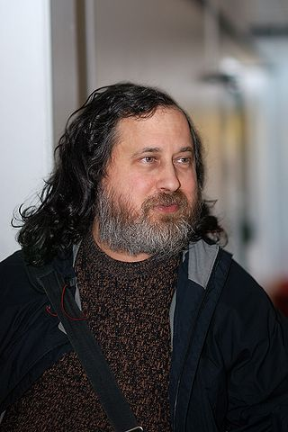

<!-- .element: style="margin-top: -5%;" -->
## Why using Free Software?

#### [Mario Garcia](http://mattdark.github.io) · [@mariogmd](https://twitter.com/mariogmd)

---

## Agenda

- What is Free Software?
- Who's using Free Software? <!-- .element: class="fragment" -->
- Free Software apps <!-- .element: class="fragment" -->
- GNU/Linux <!-- .element: class="fragment" -->
- Free Software in education <!-- .element: class="fragment" -->
- Where to begin? <!-- .element: class="fragment" -->
- Contributing to Free Software <!-- .element: class="fragment" -->

---

## What is Free Software?

***

- Freedom 0: run the program for any purpose
- Freedom 1: study how the program works <!-- .element: class="fragment" -->
- Freedom 2: redistribute and make copies <!-- .element: class="fragment" -->
- Freedom 3: improve the program <!-- .element: class="fragment" -->

---

## Who's using Free Software?

- Google
- Facebook <!-- .element: class="fragment" -->
- Twitter <!-- .element: class="fragment" -->
- Wikipedia <!-- .element: class="fragment" -->
- NASA <!-- .element: class="fragment" -->

***

- Hackers
- Engineers <!-- .element: class="fragment" -->
- Makers <!-- .element: class="fragment" -->
- Teachers <!-- .element: class="fragment" -->
- Entrepreneurs <!-- .element: class="fragment" -->
- SysAdmins <!-- .element: class="fragment" -->

***

## Almost everyone!

---

## Free Software apps

- Android
- Dropbox <!-- .element: class="fragment" -->
- Mozilla Firefox <!-- .element: class="fragment" -->
- WordPress <!-- .element: class="fragment" -->
- Apache <!-- .element: class="fragment" -->

---

## GNU/Linux

***

#### Richard Stallman

***

#### Linus Torvalds

***

## Distributions

- Ubuntu
- Debian <!-- .element: class="fragment" -->
- Fedora <!-- .element: class="fragment" -->
- Linux Mint <!-- .element: class="fragment" -->
- Manjaro <!-- .element: class="fragment" -->

---

## Free Software in education

---

## Where to begin?

***

- Read about it
- Find Free Software alternatives <!-- .element: class="fragment" -->
- Ask an expert <!-- .element: class="fragment" -->
- Try it <!-- .element: class="fragment" -->
- Attend events <!-- .element: class="fragment" -->

***

## Events

- FLISoL
- Software Freedom Day <!-- .element: class="fragment" -->
- Campus Party <!-- .element: class="fragment" -->
- Hackmitin <!-- .element: class="fragment" -->
- Open Source Comes to Campus <!-- .element: class="fragment" -->

---

## Contributing to Free Software

- Use it
- Spread the word <!-- .element: class="fragment" -->
- Help others <!-- .element: class="fragment" -->
- Code <!-- .element: class="fragment" -->
- Localization <!-- .element: class="fragment" -->
- Organize events <!-- .element: class="fragment" -->

---

## More information at

_[mattdark.github.io](https://mattdark.github.io)_

___

[@mariogmd](https://twitter.com/mariogmd)

mattdark@mozilla-mexico.org
